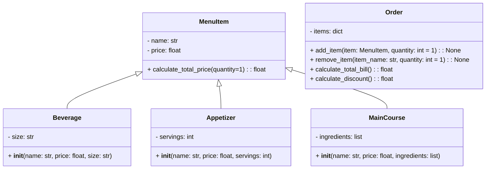

# Third_Challenge
### Figure:
This is the firs part of the challenge.

```python
import math

class Point:
  definition: str = "Entidad geometrica abstracta que representa una ubicación en un espacio."

  def __init__(self, x: float=0, y: float=0):
    self.x = x
    self.y = y

  def move(self, new_x: float, new_y: float):
    self.x = new_x
    self.y = new_y

  def reset(self):
    self.x = 0
    self.y = 0

  def compute_distance(self, point) -> float:
    return round(((self.x - point.x)**2 + (self.y - point.y)**2)**(0.5), 2)


class Line:
  definition: str = "It's a join between two points"
  def __init__(self, start_point: Point, end_point: Point):
      self.start_point = start_point
      self.end_point = end_point
      self.length = self.compute_length_line()
      self.slope = self.compute_slope()
      self.x_cross = self.compute_horizontal_cross()
      self.y_cross = self.compute_vertical_cross()

  def compute_length_line(self)-> float:
      if (self.end_point.x == self.start_point.x) and (self.end_point.y == self.start_point.y):
          return "The starting_point and the ending_point are the same, it's not a line so, it doesn't have length"
      else:
          return round((self.start_point.compute_distance(self.end_point)), 2)

  def compute_slope(self)-> float:
      if (self.end_point.x == self.start_point.x) and (self.end_point.y == self.start_point.y):
          return "The starting_point and the ending_point are the same, it's not a line so, it doesn't have slope"
      elif (self.end_point.x - self.start_point.x == 0) and (self.end_point.y != self.start_point.y):
          return 90.0
      elif (self.end_point.y - self.start_point.y == 0) and (self.end_point.x != self.start_point.x):
          return 0.0
      else:
        self.new_end_point = Point(x=self.end_point.x-self.start_point.x, y=self.end_point.y-self.start_point.y)

        if self.length == 0:
            return 0
        else:
            self.magic_formule = self.new_end_point.x/(self.length)
            if self.new_end_point.y < 0:
                return round(360 - math.degrees(math.acos(self.magic_formule)), 2)
            else:
                return round(math.degrees(math.acos(self.magic_formule)), 2)


  def compute_horizontal_cross(self)-> float:
      if 0 in range(self.end_point.y, self.start_point.y) or 0 in range (self.start_point.y, self.end_point.y):
          return "There does exist an intersection with the x-axis"
      else:
          return "There doesn't exist an intersection with the x-axis"

  def compute_vertical_cross(self)-> float:
      if 0 in range(self.end_point.x, self.start_point.x) or 0 in range (self.start_point.x, self.end_point.x):
          return "There does exist an intersection with the y-axis"
      else:
          return "There doesn't exist an intersection with the y-axis"


class Rectangle:

  def __init__(self, width: float=0, height:float=0, point: float=0) :
      self.width = width
      self.height = height
      self.point = point
      self.area = self.compute_area()
      self.perimeter = self.compute_perimeter()


  def compute_interference_point(self, interference_point)-> str:
      self.interference_point = interference_point

      if (self.interference_point.x in range(int(self.point.x - (self.width/2)), int(self.point.x + (self.width/2)))) and (self.interference_point.y in range(int(self.point.y - (self.height/2)), int(self.point.y + (self.height/2)))): 
          return "The point it's in the figure"
      else:

          return "The point it's not in the figure"


  def compute_area(self):
      area = self.width*self.height
      return area

  def compute_perimeter(self):
      perimeter = 2*(self.width + self.height)
      return perimeter


class Square(Rectangle):
    def __init__(self, side, point):
        super().__init__(side, side, point)


if __name__ == "__main__":

    print("Hello user, this code could calculate the area, perimeter, interference point, and interference \nline of a square or rectangle, depending on the method that you choose: ")
    print("Which figure would you like to use?")

    start = True
    figure: str = input("Write square or rectangle, depending on the figure that you want to work: ")

    print("\nMethod 1 will take the coordinates of the Bottom-left corner point, the width and height")
    print("Method 2 will take the coordinates of the center point, the width, and the height")
    print("Method 3 will take the coordinates of two opposite points")
    print("Method 4 will take the coordinates of four lines, because a rectangle is composed of four lines")

    method: int = int(input("Enter the method that you want to use: "))

    if method == 1:
          bottom_left_corner =  Point(x= int(input("Enter the coordinate in x of the bottom left corner: ")), y= int(input("Enter the coordinate in y of the bottom left corner: ")))
          rectangle_height:int = int(input("Enter the height of your figure: "))
          rectangle_width:int = int(input("Enter the width of your figure: "))
          centre = Point(x= bottom_left_corner.x + (rectangle_width/2), y= bottom_left_corner.y + (rectangle_height/2))
          fuction: bool = True

    elif method == 2:
          centre = Point(x= int(input("Enter the coordinate in x of the centre: ")), y= int(input("Enter the coordinate in y of the centre: ")))    
          rectangle_height:int = int(input("Enter the height of your figure: "))
          rectangle_width:int = int(input("Enter the width of your figure: "))
          fuction: bool = True

    elif method == 3:
          first_opposite_corner = Point(x= int(input("Enter the coordinate in x of the first opposite corner: ")), y= int(input("Enter the coordinate in y of the first opposite corner: ")))
          second_opposite_corner = Point(x= int(input("Enter the coordinate in x of the second opposite corner: ")), y= int(input("Enter the coordinate in y of the second opposite corner: ")))
          rectangle_width = abs(first_opposite_corner.x -second_opposite_corner.x)
          rectangle_height = abs(first_opposite_corner.y -second_opposite_corner.y)

          if first_opposite_corner.x < second_opposite_corner.x and first_opposite_corner.y < second_opposite_corner.y:
              centre = Point(x= first_opposite_corner.x + (rectangle_width/2), y= first_opposite_corner.y + (rectangle_height/2))

          elif first_opposite_corner.x < second_opposite_corner.x and first_opposite_corner.y > second_opposite_corner.y:
              centre = Point(x= first_opposite_corner.x + (rectangle_width/2), y= first_opposite_corner.y - (rectangle_height/2))

          elif first_opposite_corner.x > second_opposite_corner.x and first_opposite_corner.y > second_opposite_corner.y:
              centre = Point(x= first_opposite_corner.x - (rectangle_width/2), y= first_opposite_corner.y - (rectangle_height/2))

          elif first_opposite_corner.x > second_opposite_corner.x and first_opposite_corner.y < second_opposite_corner.y:
              centre = Point(x= first_opposite_corner.x - (rectangle_width/2), y= first_opposite_corner.y + (rectangle_height/2)) 


          fuction: bool = True

    elif method == 4:
        print("The vertices must coincide in 'y' or in the 'x' of the consecutive vertex.")
        first_corner = Point(x= int(input("Enter the coordinate in x of the first corner: ")), y= int(input("Enter the coordinate in y of the first corner: ")))
        second_corner = Point(x= int(input("Enter the coordinate in x of the second corner: ")), y= int(input("Enter the coordinate in y of the second corner: ")))
        third_corner = Point(x= int(input("Enter the coordinate in x of the third corner: ")),  y= int(input("Enter the coordinate in y of the third corner: ")))
        fourth_corner = Point(x= int(input("Enter the coordinate in x of the fourth corner: ")), y= int(input("Enter the coordinate in y of the fourth corner: ")))
        if first_corner.y == second_corner.y and second_corner.x == third_corner.x:
            print("The vertices are correctly aligned in height or length.") 
            first_line: Line = Line(start_point = first_corner, end_point = second_corner)
            second_line: Line = Line(start_point = second_corner, end_point = third_corner)
            third_line: Line = Line(start_point = third_corner, end_point = fourth_corner)
            fourth_line: Line = Line(start_point = fourth_corner, end_point = first_corner)

            rectangle_width = abs(first_corner.x - second_corner.x)
            rectangle_height = abs(first_corner.y - third_corner.y)
            centre= Point(x=(first_corner.x + second_corner.x) /2, y= (first_corner.y + third_corner.y)/2)

            fuction: bool = True
        else:
            print("The vertices are not correctly aligned in height or length.")

            fuction: bool = False

    else:
        fuction: bool = False

    if fuction == False:

        print("Invalid method") 

    else:
        if figure == "rectangle":
            figure = Rectangle(width=rectangle_width, height=rectangle_height, point=centre)

        else: 
            figure = Square(side=rectangle_height, point=centre)

        print("\nThe area of this figure is:", figure.area)
        print("\nThe perimeter of this figure is: ", figure.perimeter)

        print("\nLet`s check if a point is in our figure")
        interference__point = Point(x=int(input("Enter the coordinate in x of the point: ")), y=int(input("Enter the coordinate in y of the point: ")))
        print(interference__point.x, interference__point.y)
        print(figure.compute_interference_point(interference_point = interference__point))

    Linea = Line(start_point=Point(x=int(input("Enter the coordinate in x1 of the point: ")), y=int(input("Enter the coordinate in y1 of the point: "))), end_point=Point(x=int(input("Enter the coordinate in x2 of the point: ")), y=int(input("Enter the coordinate in y2 of the point: "))))
    print(Linea.slope)
```    

### Restaurant:
Below you will find the second part of the challenge.
This is a program to calculate the bill for a customer's order at a restaurant.

This is the code I made for this challenge.

```python
class MenuItem:
    def __init__(self, name, price):
        self.name = name
        self.price = price

    def calculate_total_price(self, quantity=1):
        return self.price * quantity
    
class Beverage(MenuItem):
    def __init__(self, name, price, size):
        super().__init__(name, price)
        self.size = size

class Appetizer(MenuItem):
    def __init__(self, name, price, servings):
        super().__init__(name, price)
        self.servings = servings

class MainCourse(MenuItem):
    def __init__(self, name, price, ingredients):
        super().__init__(name, price)
        self.ingredients = ingredients

class Order:
    def __init__(self):
        self.items = {}

    def add_item(self, item, quantity=1):
        if item.name in self.items:
            self.items[item.name]["quantity"] += quantity
        else:
            self.items[item.name] = {"item": item, "quantity": quantity}

    def remove_item(self, item_name, quantity=1):
        if item_name in self.items:
            if quantity >= self.items[item_name]["quantity"]:
                del self.items[item_name]
            else:
                self.items[item_name]["quantity"] -= quantity
        else:
            print(f"'{item_name}' no está en el pedido.")

    def calculate_total_bill(self):
        total_bill = 0
        for item_info in self.items.values():
            item = item_info["item"]
            quantity = item_info["quantity"]
            total_bill += item.calculate_total_price(quantity)

        total_bill -= self.calculate_discount()

        return total_bill
    
    def calculate_discount(self):
        if len(self.items) > 3:
            return self.calculate_total_bill() * 0.05
        else:
            return 0

order = Order()
beverage1 = Beverage("Coffee", 1.50, "Small")
beverage2 = Beverage("Tea", 1.50, "Small")
beverage3 = Beverage("Soft drinks", 2.00, "Small")
beverage4 = Beverage("Fruit juice", 2.50, "Small")
beverage5 = Beverage("Water", 1.00, "Small")
beverage6 = Beverage("Sparkling water", 1.50, "Small")
appetizer1 = Appetizer("Potato soup Colombian style", 6.99, 1)
appetizer2 = Appetizer("Fried squid with spicy tomato sauce", 9.99, 1)
main_course1 = MainCourse("Brazilian Steak", 24.99, ["Beef", "Potatoes", "Vegetables"])
main_course2 = MainCourse("Grilled Fish", 18.50, ["Fish", "Rice", "Vegetables"])
main_course3 = MainCourse("Roast Chicken", 16.99, ["Chicken", "Mashed Potatoes", "Green Beans"])
```
