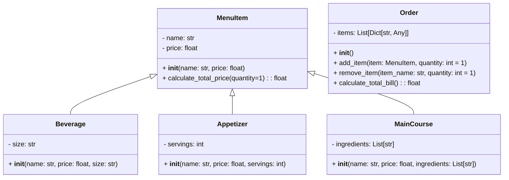

# Third_Challenge
### Figure:
This is the firs part of the challenge.

### Restaurant:
Below you will find the second part of the challenge.
This is a program to calculate the bill for a customer's order at a restaurant.

This is the code I made for this challenge.

```python
class MenuItem:
    def __init__(self, name, price):
        self.name = name
        self.price = price
    def calculate_total_price(self, quantity=1):
        return self.price * quantity


class Beverage(MenuItem):
    def __init__(self, name, price, size):
        super().__init__(name, price)
        self.size = size


class Appetizer(MenuItem):
    def __init__(self, name, price, servings):
        super().__init__(name, price)
        self.servings = servings


class MainCourse(MenuItem):
    def __init__(self, name, price, ingredients):
        super().__init__(name, price)
        self.ingredients = ingredients


class Order:
    def __init__(self):
        self.items = []
    def add_item(self, item, quantity=1):
        self.items.append({"item": item, "quantity": quantity})
    def remove_item(self, item_name, quantity=1):
        for item in self.items:
            if item["item"].name == item_name:
                if item["quantity"] <= quantity:
                    self.items.remove(item)
                else:
                    item["quantity"] -= quantity
                return
        print(f"'{item_name}' no está en el pedido.")
    def calculate_total_bill(self):
        total_bill = 0
        for item_info in self.items:
            item = item_info["item"]
            quantity = item_info["quantity"]
            total_bill += item.calculate_total_price(quantity)
        return total_bill


order = Order()
beverage1 = Beverage("Coffee", 1.50, "Small")
beverage2 = Beverage("Tea", 1.50, "Small")
beverage3 = Beverage("Soft drinks", 2.00, "Small")
beverage4 = Beverage("Fruit juice", 2.50, "Small")
beverage5 = Beverage("Water", 1.00, "Small")
beverage6 = Beverage("Sparkling water", 1.50, "Small")
appetizer1 = Appetizer("Potato soup Colombian style", 6.99, 1)
appetizer2 = Appetizer("Fried squid with spicy tomato sauce", 9.99, 1)
main_course1 = MainCourse("Brazilian Steak", 24.99, ["Beef", "Potatoes", "Vegetables"])
main_course2 = MainCourse("Grilled Fish", 18.50, ["Fish", "Rice", "Vegetables"])
main_course3 = MainCourse("Roast Chicken", 16.99, ["Chicken", "Mashed Potatoes", "Green Beans"])


